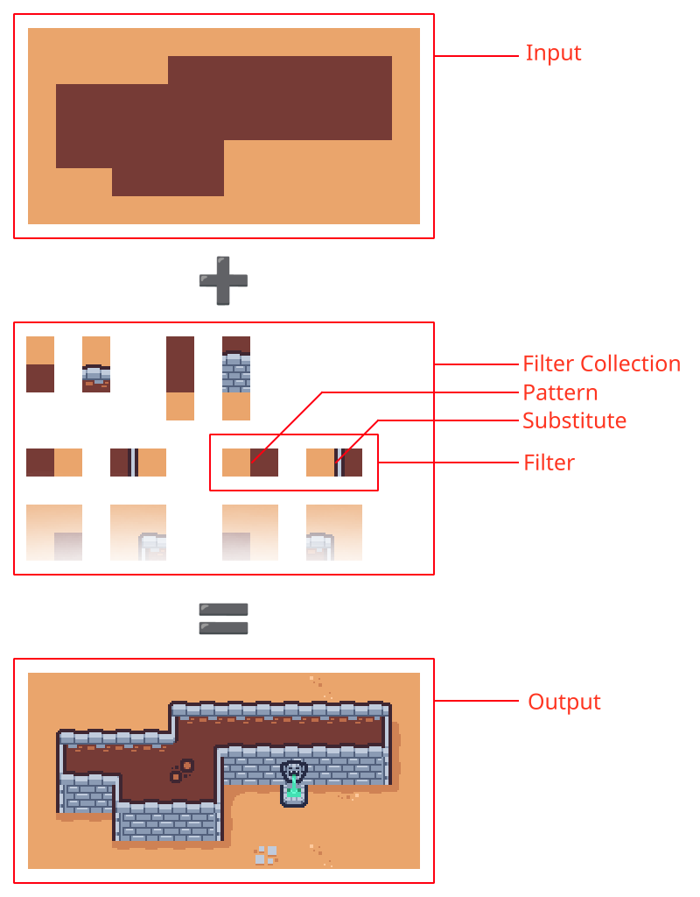

# TiSu - Tile Substitutions

TiSu is a tool for processing 2d tile based maps by replacing predefined patterns with given substitutes.


## Basic Usage (with [Tiled Map Editor](https://www.mapeditor.org/))

Run using Cargo:

```bash
cargo run --input input.tmx --filters filters.tmx --output output.tmx
```

TiSu currently only supports .tmx (Tiled maps) and .tsx (Tiled tile sets) files.

### Filters

Filters are also parsed from a Tiled map (.tmx) in the following way:
* Transparent fields are ignored
* Rectangular areas of the map are detected and grouped into pairs (starting from top-left)
* The first area in that pair represents the pattern while the second is the substitute

## Advanced Usage

### The Wildcard Tile

If the total number of rectangular areas is odd, the first one is one is considered to be the wildcard tile. A wildcard can modify the way a filter is applied and can be present in both, the pattern and in the substitute.
When present in a pattern, it will match against any tile during the pattern matching.
When present in a substitute, it will result in an unmodified tile during the substitute replacement.

### Filter Properties

Layer properties are interpreted as filter properties. The following properties are defined:
* `probability`: `float` - Has a value in the range `[0..1]` (default is `1`). Defines the probability at which a substitution will happen (where 0.0 means 0% and 1.0 means 100%).
* `iterations`: `int` - Defines how many times a filter will be applied to the whole map (default is `1`).
* `ignore`: `bool` - If `true`, the filter will be ignored (default is `false`).
* `pattern_matching`: `string` - Can be set to `source` or `destination` (default is `source`). When a filter is applied to a map, first a copy is created on which all substitutions are done and will represent the result of the filtering. This property defines on which of these two maps will pattern matching be performed. `source` refers to the original map, while `destination` refers to the copy. Performing pattern matching on the `destination` map can greatly impact the result of filtering, as it takes into account substitutions that were performed in previous filtering steps.

### The GUI

[gui/tisu_gui.py](gui/tisu_gui.py) is a simple GUI written in Python using tkinter. It can simplify TiSu usage from the Tiled map editor when run as a [custom command](https://doc.mapeditor.org/en/stable/manual/using-commands/), using the following parameters:
* Executable: `python3`
* Arguments: `<tisu directory>/gui/tisu_gui.py --input %mapfile --working_dir %mappath`
* Working Directory: `<tisu directory>/gui/`
* Shortcut (optional): `F5` (or any other key)

## Examples

An example based on [Kenney's Tiny Dungeon](https://kenney.nl/assets/tiny-dungeon) tileset can be found in the [examples](examples/kenney_tiny_dungeon/) directory.
